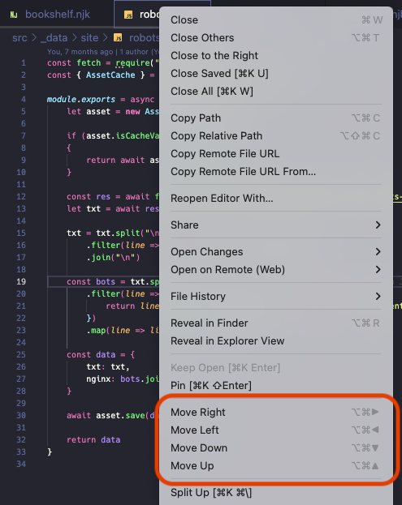

# Move File to Group

Add options to move the selected file to a different group the tab contextual menu.

## Features

Long-time JetBrains IDE users will be familiar with the "Move [direction]" options from the tab contextual menus. VS Code defaults to Split, which isn't always the most ideal, and the Move commands are buried in keyboard settings & never surfaced in any menus.

This extension puts "Move [direction]" options in two places:

- the editor tab contextual (right click) menu
- the View > Editor Layout... menu

## Known Issues

As of right now, the extension only works on the tab that currently has focus. This will be fixed in v1.0.

## Release Notes

### 0.1

Initial release of Move File to Group.
